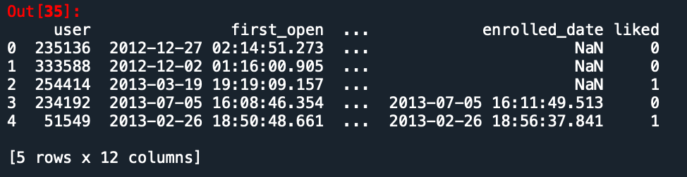
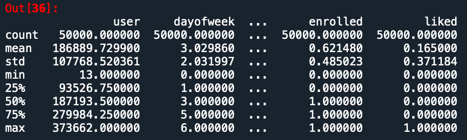
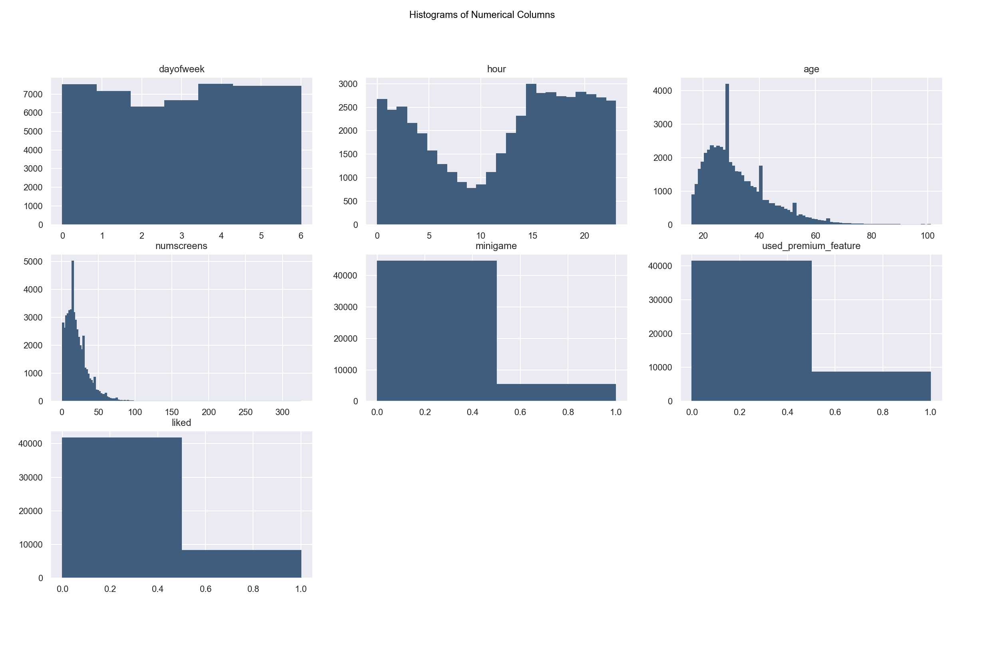
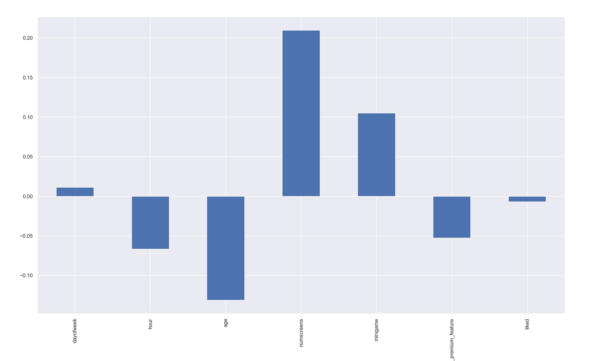
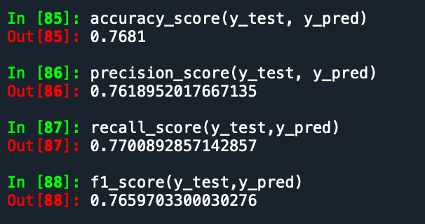
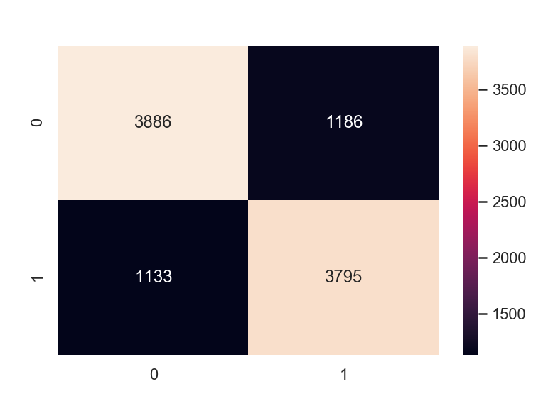
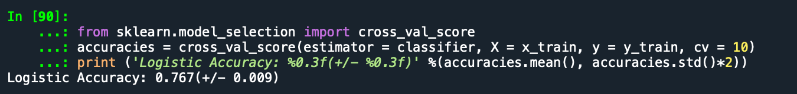
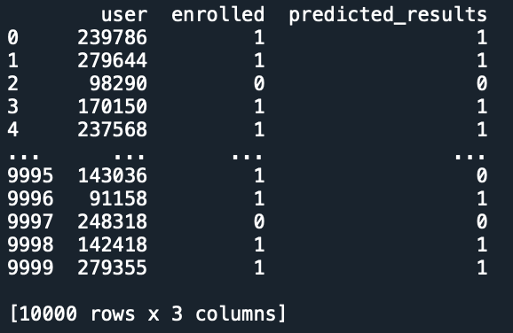

# App-behavior-analysis

__A logistic regression machine learning model that predicts which group of app users is more likely to upgrade to premium with 76% accuracy__

## EDA
The initiation phase of the project starts with data cleaning and visualization <br />
To do that we first need to import the necessary libraries 

```python
import pandas as pd
import numpy as np
import matplotlib.pyplot as plt
import seaborn as sns
from dateutil import parser
from heatmap import heatmap, corrplot
%matplotlib qt
```
read the appdata10.csv file and get a better idea of what kind of data we are dealing with by using :

```python
df = pd.read_csv('appdata10.csv')
df.head()
df.describe()
```



The data is useful, but we are better off with a visual representation of the data we are using <br />
To do this, we want to plot all the columns containing numerical data <br />
We remove columns: <br />
~~"user", 'screen_list', 'enrolled_date', 'first_open','enrolled'~~

```python
df['hour'] = df.hour.str.slice(0,3).astype(int)
dataset = df.copy().drop(columns = ["user", 'screen_list', 'enrolled_date', 'first_open','enrolled'])
```
Columns are now ready for plots <br />
Let's use a set of Histograms for this task

### Graph analysis

```python
plt.suptitle("Histograms of Numerical Columns")
sns.set()
for i in range(1,dataset.shape[1]+1):
    plt.subplot(3,3,i)
    plt.gca().set_title(dataset.columns[i-1])
    val = np.size(dataset.iloc[:,i-1].unique())
    plt.hist(dataset.iloc[:,i-1] ,bins = val, color = '#3F5D7D',edgecolor = '#3F5D7D')
```
The code yields the following:<br />


What the graph tells us:

	1. dayofweek: 	The data is quite evenly distributed which makes sense because this app doesn't require major time commitment.
	
	2. hour: 	The hours here are in military time, so we do see a dip from 1 to 10, most people are asleep during this time so the data make sense.
	
	3. age: 	The histogram is right skewed. This tells us that the users of this app is on the younger side.
	
	4. numscreens: 	This histogram shows us the total number of screens clicked per user of the app. Most people will navigate to the screen they like, a process that usually takes few hits then stops. So having a right skewed graph does make sense from the persepctive of human behavior.

	5. minigame:	This is a binary variable that shows whether users played the mini game built in to the app. 0 is no, and 1 is yes. There are less users who played the minigame than those that did.
	
	6. used_premium:This is a binary variable that shows whether users used the premium features of the app. 0 is no, and 1 is yes. There are less users who used the features than those that did
	
	7. liked:	This is a binary variable that shows whether users liked the app. 0 is no, and 1 is yes. There are less users who liked the app than those that did
	
### Correlation
Let's find the correlation between the dependent variable - __enrolled__, and the independent variables (columns 1-7 used in the histogram above)
```python
dataset.corrwith(df.enrolled).plot.bar()
```


-- As we can see here that the independent variable - __numscreens__ has the highest correlation with the dependent variable - __enrolled__. The more screens per user, the more likely for the user to enroll in the premium features.<br />
-- Looks like this relation also applies to minigames, where positive engagement with the built in minigames leads to active enrollments of the app's premium features.<br />
-- One thing to note here is that the relationship between enrolled users and age is inverse proportional, this means the older the users, the less likely they are to enroll for premium features.<br />

### Coorelation Matrix
Now let's expand out knowledge by looking at the correlation matrix of these variables<br />
We do so by defining two functions 
```
def heatmap(x, y, **kwargs):
def corrplot(data, size_scale=500, marker='s'):
```
Once these two functions are executed, run the following to get the correlation matrix:
```
corr = dataset.corr()
plt.figure(figsize=(10, 10))
ax = sns.heatmap(
    corr, 
    vmin=-1, vmax=1, center=0,
    cmap=sns.diverging_palette(20, 220, n=200),
    square=True
)
ax.set_xticklabels(
    ax.get_xticklabels(),
    rotation=45,
    horizontalalignment='right'
)
ax.set_title('Correlation Matrix', size = 20)
```


This correlation matrix tells us that users who uses premium features are more likely to interact with the app's mini game, and tends to click on more screens. This makes sense because playing mini games and opening more screens
is a sign of user's active engagement. A user who's more engaged with the app is more likely to enroll in premium features.
The correlation matrix also tells us older users are less likely to open up more screens. We can infer from the correlation matrix that our app is most appealing to the younger generation that spends a lot of time engageing with the app's features.
<br />
**Note here that we did "from heatmap import heatmap" earlier. This is a library made by Drazen Zaric who also created the correlation matrix code above.
I didn't use the heatmap library mostly because it adjusts the size of the heatmap according the correlation value. The correlation
of our indenpendent variables are so minimal that using the library makes it really hard to see what the relationships are. You are welcome to use it, or just
use the code in my .py file. Both of them work, I just like the one I have better becase it's clearer**

## Feature Engineering
It's time to clean up the data for the model we are about to build<br />
The frist step is to parse columns with dates in the dataset:<br />

```python
df['first_open'] = [parser.parse(row_data) for row_data in df['first_open']]
df['enrolled_date'] = [parser.parse(row_data) if isinstance(row_data, str) else row_data for row_data in df['enrolled_date']]
```

With that out of the way, we need to find how long it took for the users to enroll in premium features (those that did enroll) after the initial launch of the app. <br />
We call the new variable "difference":
```python
df['difference'] = (df.enrolled_date - df.first_open).astype('timedelta64[h]')
df.info()

plt.hist(df['difference'].dropna(), range(0,20))
plt.title("Distribution of Time-Since-Enrolled")
plt.show()
```
We plot the difference into a histogram and this is what we see:


The majority of users who signed up for premium features usually did within in the first 10 hours after the initial launch of the app.<br />
This is a interesting find, and we will base our analysis on this finding by excluding the users who enrolled after two days.<br />
```python
df.loc[df.difference > 48, 'enrolled'] = 0
df = df.drop(columns = ['difference','enrolled_date','first_open'])
```

Now switching gears;<br />
let's look at what screens people are most likely to click on<br />
luckily for us, the most popular screens are provided in the form of .csv called "top_screens"<br />
We will import the csv and use it to filter our "screen_list" column:<br />
```python

top_screens = pd.read_csv('top_screens.csv').top_screens.values


df['screen_list'] = df.screen_list.astype(str)+','

for sc in top_screens:
    df[sc] = df.screen_list.str.contains(sc).astype(int)
    df["screen_list"] = df.screen_list.str.replace(sc+',','')

df['Other'] = df.screen_list.str.count(',')
df = df.drop(columns = ['screen_list'])
```
**Watch out for variables that are related to each other** <br />
Funnels are created to prevent unwanted correlation:
```python
savings_screens = ["Saving1",
                    "Saving2",
                    "Saving2Amount",
                    "Saving4",
                    "Saving5",
                    "Saving6",
                    "Saving7",
                    "Saving8",
                    "Saving9",
                    "Saving10"]
df["SavingCount"] = df[savings_screens].sum(axis=1)
df = df.drop(columns=savings_screens)

cm_screens = ["Credit1",
               "Credit2",
               "Credit3",
               "Credit3Container",
               "Credit3Dashboard"]
df["CMCount"] = df[cm_screens].sum(axis=1)
df = df.drop(columns=cm_screens)

cc_screens = ["CC1",
                "CC1Category",
                "CC3"]
df["CCCount"] = df[cc_screens].sum(axis=1)
df = df.drop(columns=cc_screens)

loan_screens = ["Loan",
               "Loan2",
               "Loan3",
               "Loan4"]
df["LoansCount"] = df[loan_screens].sum(axis=1)
df = df.drop(columns=loan_screens)
```
Export the clean data into a new csv
```python
df.to_csv('new_appdata10.csv', index = False)
```
**Data cleaning complete**

# Model Building
Now it's time for us to build the acutal model using the clean data.<br />
we frist import the needed library and split the independent varialbes and the dependent variable (enrolled)
```python
import pandas as pd
import numpy as np
import seaborn as sns
import matplotlib.pyplot as plt
import time

dataset = pd.read_csv('new_appdata10.csv')

response = dataset['enrolled']
dataset = dataset.drop(columns = 'enrolled')
```

Split the dataset into the training set and the test set:

```python
from sklearn.model_selection import train_test_split
x_train, x_test, y_train, y_test = train_test_split(dataset,response,test_size=0.2, random_state = 0)

train_identifier = x_train ['user']
x_train = x_train.drop(columns = 'user')
test_identifier = x_test ['user']
x_test = x_test.drop(columns = 'user')
```
**Note: we want to identify the data after we completed the train test split. By creating an identifier for the test sets, we can add the column names back into the data frame consists of the newly split dataset. 

Standardize the data:
```python
from sklearn.preprocessing import StandardScaler
sc = StandardScaler()
x_train2 = pd.DataFrame(sc.fit_transform(x_train))
x_test2 = pd.DataFrame(sc.transform(x_test))
x_train2.columns = x_train.columns.values
x_test2.columns = x_test.columns.values
x_train2.index = x_train.index.values
x_test2.index = x_test.index.values

x_train = x_train2
x_test = x_test2
```
We use Logistic Regression for this analysis <br />
Note that we use "l1" as penalty <br />
This is because due to the nature of app data, which can sometimes be strongly correlated to each other. We want to minimize any significant correlation between variables. The goal of having "l1" as penalty for the logistic regression is so that we can have an unbiased regression givin a dataset from an app.
```
from sklearn.linear_model import LogisticRegression
classifier = LogisticRegression(random_state = 0, penalty = 'l1',solver='liblinear')
classifier.fit(x_train, y_train)

y_pred = classifier.predict(x_test)
```
## Metrics
Let's see how well our model did:
```Python
from sklearn.metrics import accuracy_score, confusion_matrix, f1_score, precision_score, recall_score
cm = confusion_matrix(y_test, y_pred)
accuracy_score(y_test, y_pred)
precision_score(y_test, y_pred)
recall_score(y_test,y_pred)
f1_score(y_test,y_pred)
```


here's the heatmap for our predicted results vs the testing set results
```python
from sklearn.model_selection import cross_val_score
accuracies = cross_val_score(estimator = classifier, X = x_train, y = y_train, cv = 10)
print ('Logistic Accuracy: %0.3f(+/- %0.3f)' %(accuracies.mean(), accuracies.std()*2))
```


We have an accuracy score around 76% <br />
Let's confirm it using cross validation:
```python
from sklearn.model_selection import cross_val_score
accuracies = cross_val_score(estimator = classifier, X = x_train, y = y_train, cv = 10)
print ('Logistic Accuracy: %0.3f(+/- %0.3f)' %(accuracies.mean(), accuracies.std()*2))
```

The cross validation method confirms that our Logistic Accuracy: is around 76.7%(+/- 0.009)<br />

__Finally, let's put the original data and the predicted data side by side in a chart__
```python
final_results = pd.concat([y_test, test_identifier], axis = 1).dropna()
final_results['predicted_results'] = y_pred
final_results[['user', 'enrolled','predicted_results']].reset_index(drop = True)
```


## Conclusion
## Future Work
Data courtesy of SuperDataScience.com
Code idea origin: Dr.Ryan Ahmed PhD. MBA (modified)
